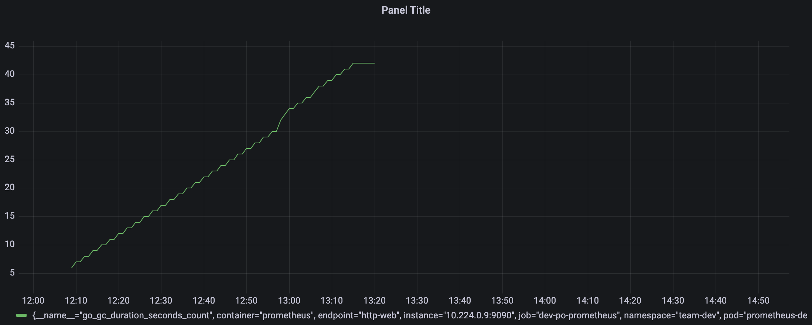

## What are custom metrics

Prometheus will collect all kind of standard container metrics like CPU and memory usage, but no (custom) business or customer metrics like the number of customers who logged into your app each hour.

To be able to collect custom metrics you will need to expose this data in your code. This is called instrumentation of code and can include annotating the code with metadata, or adding in logic to calculate and expose data.

Instrumenting code means you write code to expose information about the technical, business, and customer context. This information can then be collected and analyzed using Prometheus and Grafana.

In this guide we will not dive into the way how to instrument your code. We will assume you have a container that exposes custom metrics and will show how the custom metrics can be collected and analysed.

:::info
In this guide we assume that otomi is configured for multi-tenancy and that each Team in Otomi is provided with a dedicated Prometheus instance that will be used for collecting custom metrics only.
:::

## Deploy your container

For this lab we'll use a prometheus-dummy-exporter container from Google

- Now go to your team's Git repo for ArgoCD `(otomi/team-<name>-argocd)`

- Create a new file in the repo called custom-metrics.yaml
- Add the following contents to the file:

```yaml
apiVersion: apps/v1
kind: Deployment
metadata:
  name: custom-metrics
spec:
  replicas: 1
  selector:
    matchLabels:
      app: custom-metrics
  template:
    metadata:
      labels:
        app: custom-metrics
    spec:
      containers:
        - name: custom-metrics
          image: us-docker.pkg.dev/google-samples/containers/gke/prometheus-dummy-exporter:v0.2.0
          command: ["./prometheus-dummy-exporter"]
          args:
          - --metric-name=custom_prometheus
          - --metric-value=40
          - --port=8080
          resources:
            limits:
              memory: '128Mi'
              cpu: '200m'
            requests:
              memory: '64Mi'
              cpu: '100m'
          securityContext:
            runAsUser: 1001
          ports:
            - name: metrics
              containerPort: 8080
              protocol: TCP
---
apiVersion: v1
kind: Service
metadata:
  name: custom-metrics
spec:
  selector:
    app: custom-metrics
  ports:
    - name: metrics
      port: 8080
      targetPort: 8080
      protocol: TCP
---
apiVersion: monitoring.coreos.com/v1
kind: ServiceMonitor
metadata:
  name: custom-metrics
  labels:
    app: custom-metrics
    prometheus: team-dev
spec:
  namespaceSelector:
    matchNames:
    - team-dev
  selector:
    matchLabels:
      app: custom-metrics
  endpoints:
  - port: metrics
    path: /metrics
```

Note that the `ServiceMonitor` has a selector `prometheus: team-dev`. This is required to make sure the metrics are only collected by the team's private Prometheus instance.


## Configure a Grafana dashboard

Configure a Grafana dashboard to analyse the custom metrics:

- Open Grafana in the Team's apps
- Go to the Grafana dashboard homepage
- In the left-side navigation pane, choose + > Dashboard
- On the New dashboard page, click Add new panel
- On the New dashboard / Edit Panel
- In the A collapsible section, select a metric from the Metrics drop-down list. In our example we use the `go_gc_duration_second_count_` metric

You should now see something like this:



