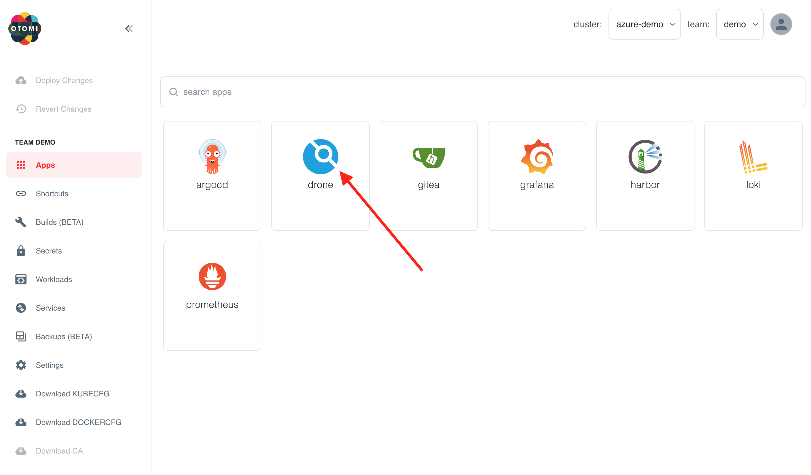
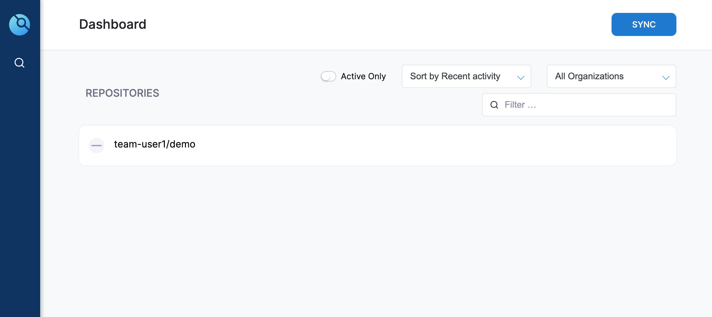
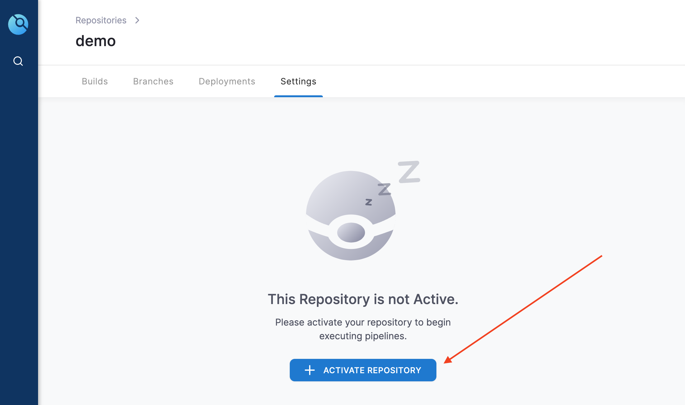
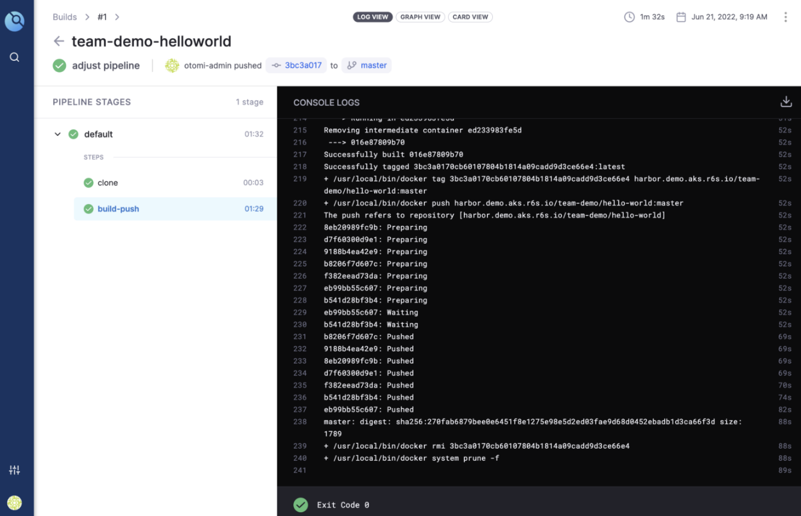

Kubernetes is a container orchestrator, so we need to create container images that we can deploy. Next to providing a Git service. Otomi also has a complete CI solution called Drone integrated. You can use Drone to create and run CI pipelines to build images and push them to your private image registry (Harbor).

## Prerequisites

Before you can use Drone to run CI pipelines, you will need to have:

1. A Git repository
2. Credentials to push images to the registry (your private registry on the platform)

## Creating a build pipeline in Drone

In the apps section in Otomi console, you'll see an app called Drone. Click on it.



- Go to the Drone dashboard, and click on ‘SYNC’. You will now see your repo pop up in the REPOSITORIES list.



- Click on the new repo and then click ‘ACTIVATE’.




Now we’ll need to add the credentials of the robot account as secrets toDrone:

- Click on your repository.
- Under Settings, Click on secrets
- Add the following 2 secrets:

```
REGISTRY_USERNAME = <harbor-robot-account-name.
REGISTRY_PASSWORD = <the-token-of-the-robot-account>
```

Now you'll need to add a Drone pipeline definition to our repo.

- Add a `.drone.yml` file to your repo. This is an example you can use:

```
kind: pipeline
type: kubernetes
name: default
steps:
  - name: build-push
    image: plugins/docker
    settings:
      registry: harbor.<yourdomain>
      repo: harbor.<your-ip>.nip.io/team-demo/hello
      insecure: true
      username:
        from_secret: REGISTRY_USERNAME
      password:
        from_secret: REGISTRY_PASSWORD
      tags:
        - ${DRONE_BRANCH}
```

Make sure to adjust the registry and repo name in the .drone.yml file

In Drone, you will see the pipeline has automatically started building and then pushing the new image to Harbor.



If you use Harbor as a private registry, check to see if the repo has been created. You can now also use Trivy to scan your image(s) for vulnerabilities.