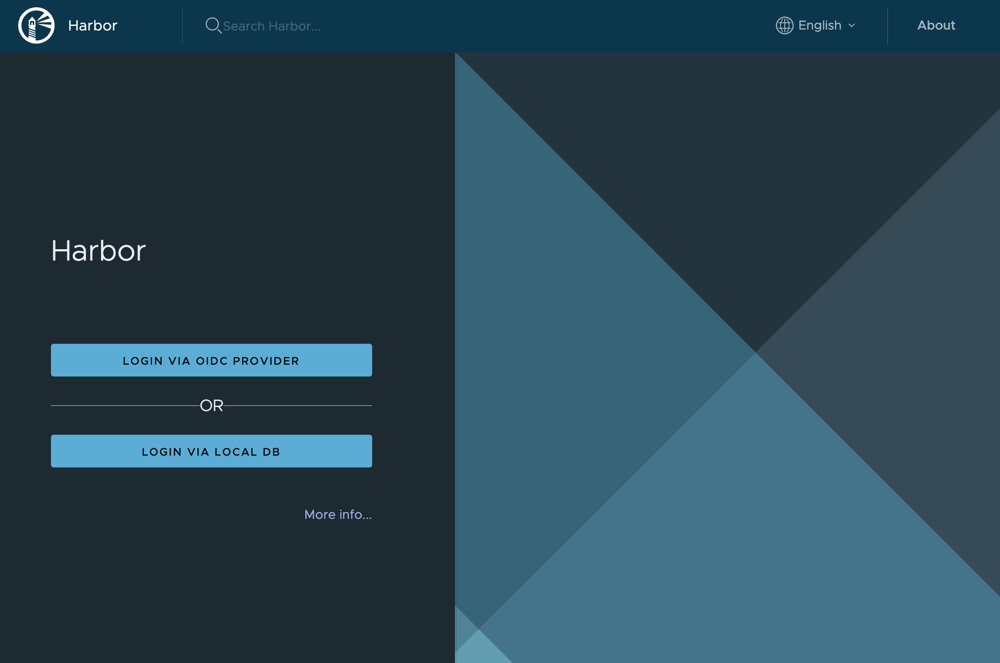
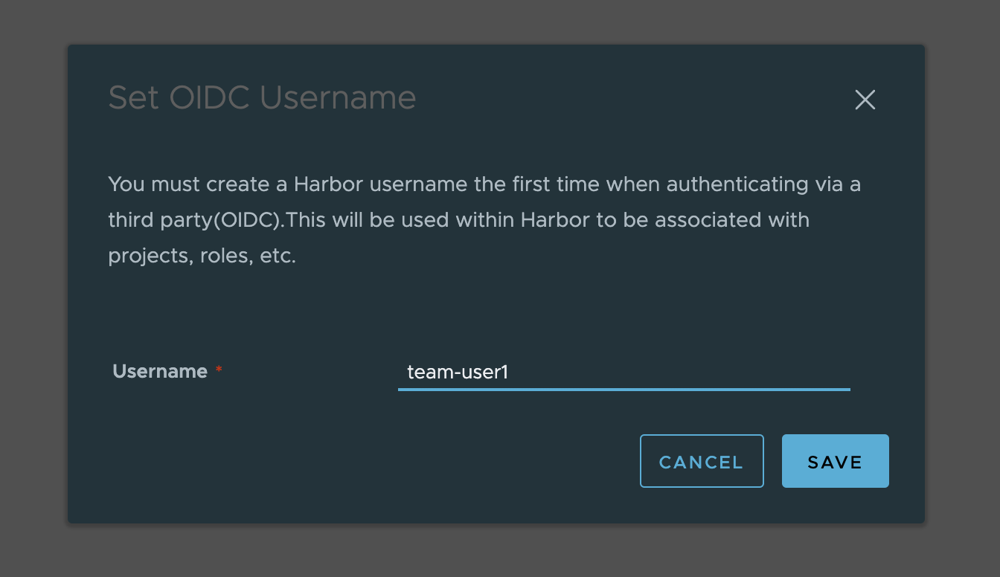
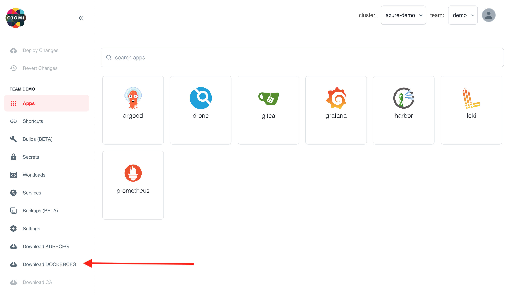

Now that you have kubectl access to your team namespace, you are ready to deploy your first container. When the platform administrator created your team, a private container registry has been automatically created for your team in Harbor and a pull secret has been added to your team namespace. To be able to push container images to your private registries, you'll first need to create a robot-account in your Harbor project with push access rights.

## Access Harbor UI

In the apps section in Otomi console, you'll see an app called Harbor. Click on it and follow these steps:

- Choose `Login via OIDC provider`



- Set your OIDC user name




- In Harbor you'll see all the projects of the teams that you are a member of


- Click on the project of your team. Here you will see all the registries of the team

## Login to Harbor

To be able to push images to Harbor, you'll need a robot account with push permissions. Otomi offers teams with a self-service option to download the Docker config for their team's private registry in Harbor. In the left menu you will see the option `Download DOCKERCFG`. Click on it to download the credentials.



When you have downloaded the docker config then run `docker login`:

```
docker login -u 'otomi-team-<team-name>-push' -p <token> harbor.<your-domain>
```

:::note
If Docker refuses to connect with an error
`x509: certificate signed by unknown authority`, go to the Otomi Console,
and click `Download CA` (if you have not done so already); then copy the
obtained file to `~/.docker/ca.crt` or restart docker desktop.
:::

- Build and tag your image

```
docker build -t harbor.<your-domain>/<team-name>/<image-name>:<tag> .
```

- Push the image to Harbor

```
docker push harbor.<your-domain>/<team-name>/<image-name>:<tag>
