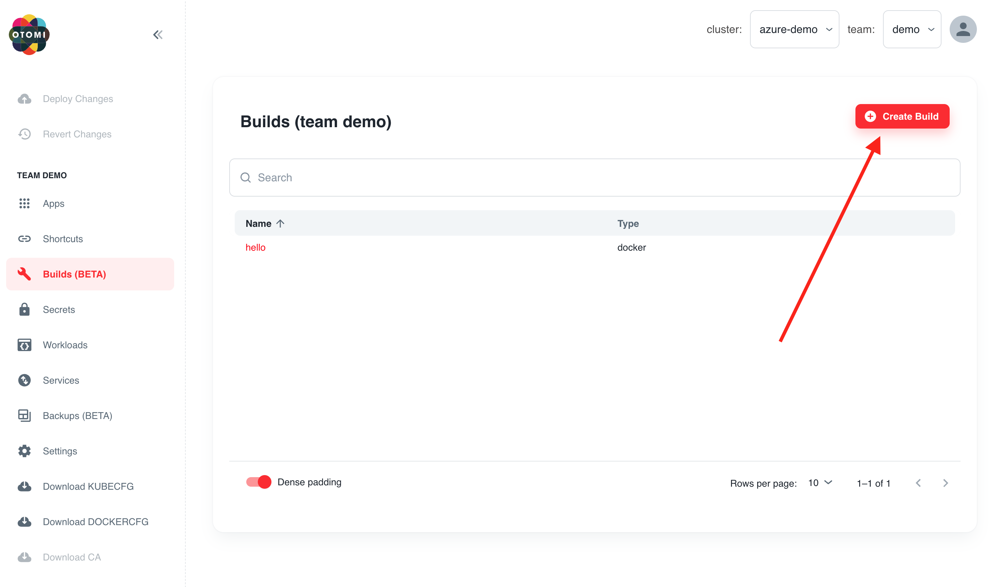

:::info
Prerequisite: For this lab, Harbor and Tekton needs to be activated.
:::

When your team is using Harbor for private image registries and Tekton is enabled on the platform level. you can build images from source using pre-configured Tekton pipelines and buildpacks from [paketo](https://buildpacks.io/docs/buildpack-author-guide/package-a-buildpack/) to build images from application source.

In this lab, you are going to create a build, using the [Spring Pet Clinic sample app](https://github.com/spring-projects/spring-petclinic) and buildpacks. When using the buildpacks option, Otomi uses buildpacks to build an image based on application source code without using a Dockerfile.

1. In the right menu, click on `Build`
2. Click on `Create Build`



3. Fill in the name `petclinic` for your build and a tag (default is tag is latest)
4. Choose `Buildpacks`
5. In the `Application source` section, fill in the following:
- RepoURL: https://github.com/spring-projects/spring-petclinic
- revision: 82cb521d636b282340378d80a6307a08e3d4a4c4


6. Click `Submit`


When the build is ready, you will see the image in Harbor:

1. Open Harbor
2. Click on the project of your team. Here you will see all the registries of the team, including the registry of the new build image
   


When using the Build feature in Otomi, a Tekton Pipeline is created and the pipline is executed only once using a Tekton Pipelinerun. To run the build again, follow these steps:

1. Change the tag of the build to `1.0.0`
2. Use the following command to run the pipeline again:

```
tkn pipeline start buildpacks-build-petclinc  --use-pipelinerun buildpacks-build-petclinc
```