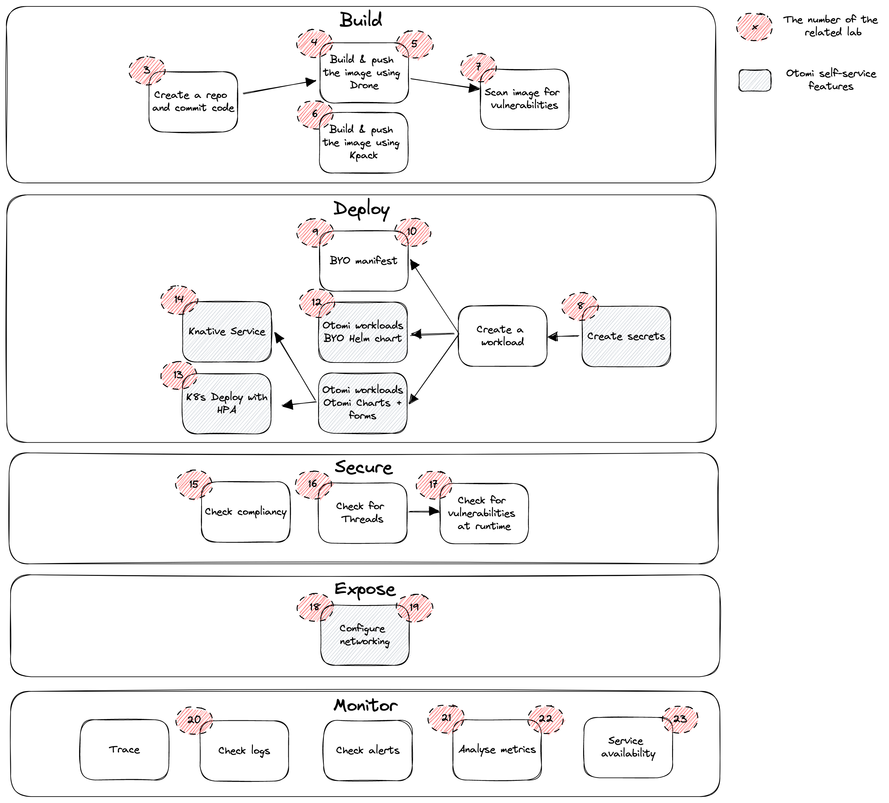

Welcome to Otomi! If you are a developer and are going to use Otomi Platform, these getting started labs are for you. Step by step we'll guide you in using Otomi to deploy and manage your containerized applications. The getting started with Otomi for developers contains a set of labs to cover all the activities in the following developer workflow:

## Prerequisites

- Lab 1: [Prerequisites](lab-1)
- Lab 2: [Access Otomi Console, download the Kubecfg and use Kubectl](lab-2)

## Building images

- Lab 3: [Create a private Git repo](lab-3)
- Lab 4: [Create a CI (build) pipeline](lab-4)
- Lab 5: [Push container images to your private repo](lab-5)
- Lab 6: [Create builds using Otomi](lab-6)
- Lab 7: [Scan your images for vulnerabilities](lab-7)

## Deploy application workloads

- Lab 8: [Create secrets](lab-8)
- Lab 9: [BYO manifest to deploy a workload using Kubectl](lab-9)
- Lab 10: [BYO manifest to deploy a workload with Argo CD](lab-10)
- Lab 11: [Configure ArgoCD image updater](lab-11)
- Lab 12: [Deploy BYO Helm chart](lab-12)
- lab 13: [Create regular workloads using Otomi charts](lab-13)
- lab 14: [Deploy Serverless workloads using Otomi charts](lab-14)

## Secure

- Lab 15: [Check policy compliance](lab-15)
- Lab 16: [Check for threads](lab-16)
- Lab 17: [Scan your running containers for vulnerabilities](lab-17)

## Expose

- Lab 18: [Publicly expose a service](lab-18)
- Lab 19: [Configuring network policies](lab-19)

## Monitor

- Lab 20: [View container logs](lab-20)
- Lab 21: [View container metrics](lab-21)
- Lab 22: [Monitor custom metrics](lab-22)
- Lab 23: [Monitoring service availability](lab-23)
